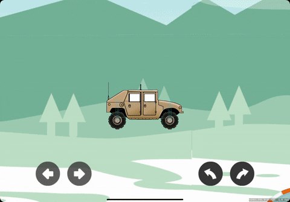
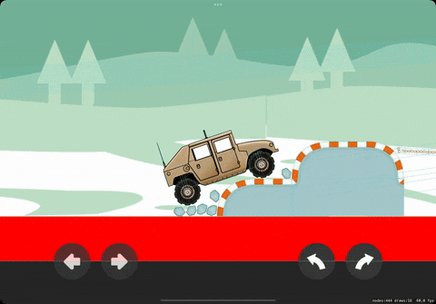
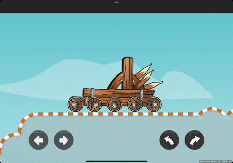

# Physics Vehicle 

# ✍️ About
🏎 Demo for physics-based 2D car behaviour and suspension [Swift, SpriteKit, iOS, macOS].

# 📜 Features
- 2D physics suspension mechanics
- Rope bridges
- HUD controls
- Multi-platform app template in action
- `SpriteKit` as a backend rendering and scene-graph framework

# 📺 Demo
Please wait while the `.gif` files are loading (there are 4 files, that weight around 8Mb)...

|  |  |
:-------------------------:|:-------------------------:
 | 
 |  

# 👨‍💻 Author 
[Astemir Eleev](https://github.com/jVirus)

# 🔖 Licence
The project is availabe under [MIT licence](https://github.com/jVirus/ios-spritekit-physics-racing/blob/master/LICENSE)
